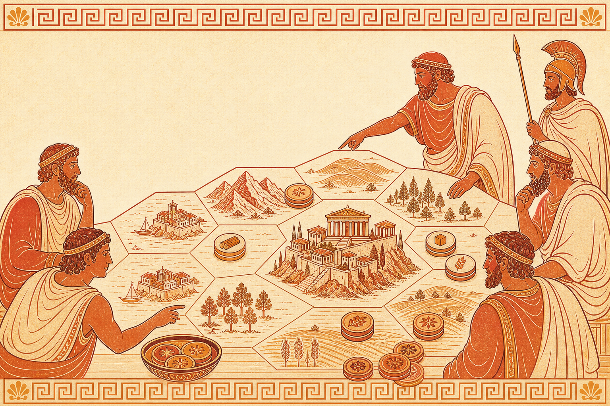

<div align="center">

# Hegemony

Become the board's hegemon through economy, diplomacy, politics and luck.

</div>

Hegemony is a strategy board game where players gather Resources to construct Buildings in Colonies and Cities to extract the maximum value out of their Pops to grow their civilsation into a hegemon!
## Features

- A hex map with different Resources, Luxury Goods and Building slots.
- Gathering Resources to construct Buildings in your Colonies and Cities.
- Growing Pops like Citizens, Freemen and Slaves for different purposes
- Voting on Resolutions that affect some or all players to introduce rivalries.

## Status

It's cooking! A local hotseat prototype in React + Vite (TypeScript) with a pure,
serializable rules engine. See [docs/project-overview.html](docs/project-overview.html)
for the living status/roadmap and a file-by-file map of where things live.

## Development

```bash
npm install
npm run dev        # start the Vite dev server
npm run check      # TypeScript type-check
npm run lint       # ESLint (npm run format for Prettier)
npm run test:run   # run the Vitest suite once (npm run test to watch)
npm run build      # production build
```

## Architecture

The hard invariant is a clean split between a **pure rules engine** and the **React UI** —
the UI never owns game state or duplicates a formula.

- `src/game/` — the engine. The whole game is one serializable `HegemonyState`
  (`types.ts`) advanced by pure functions. `rules.ts` is a barrel over cohesive modules
  (`core/`, `economy/`, `actions.ts`, `settlement.ts`, `status.ts`, `events.ts`,
  `season.ts`, `state.ts`); `turn.ts` is the turn/phase machine; `map.ts` builds the hex board.
- `src/game/ruleset.ts` — every tunable balance value (`Ruleset`), plus `deriveRuleset`
  and a `GAME_MODES` registry (standard / fast-start / deathmatch). A mode is data, not code;
  `GAME_CONFIG.mode` in `config.ts` selects one.
- `src/game/controller.ts` — `useHegemonyGame`, the only seam between React and the engine
  (Immer `produce` per move for structural sharing). `src/App.tsx` is a thin wrapper.
- `src/components/` — the UI. `HegemonyBoard.tsx` + `board/` (topbar, ledger, command, modals),
  plus `HexMap.tsx`. Styling is split into slices under `src/styles/`, loaded by the
  `src/styles.css` barrel.

The rules of the road live in [docs/v0.1-rules-spec.md](docs/v0.1-rules-spec.md) — though
where that spec and the engine disagree, **the engine is the source of truth**.
