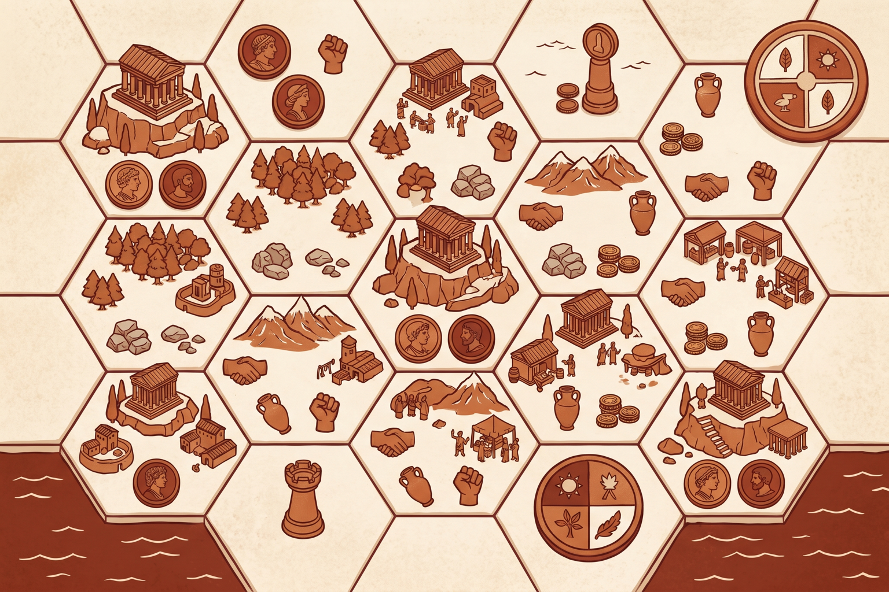

# Hegemony

Ancient strategy, civic pressure, and hex-board conquest in a hotseat browser prototype.

Hegemony is a Catan-inspired, Imperator: Rome-inspired strategy board game prototype where players found capitals, expand colonies, collect resources, manage population pressure, and compete for control across a stylized ancient world.

## Features

- 37-tile inland hex map.
- Capital and colony setup phases.
- Basic hotseat gameplay loop.
- Income collection and resource tracking.
- Four buildable structure types.
- Population and unrest foundations.

## Coming Soon

Online play, events, assembly voting, politicians, national ideas, luxury goods, trade, and victory conditions.
