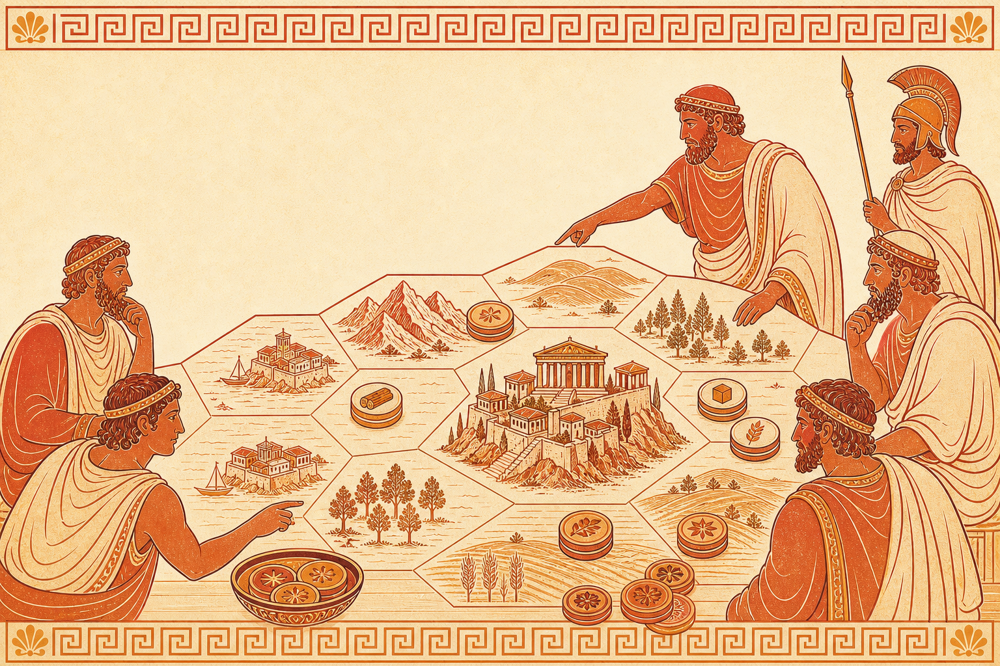

<div align="center">

# Hegemony

### Build a city-state. Command its people. Become the island's hegemon.

A strategy board game for four players, set in an ancient Greek world of
expansion, scarcity, political influence, and shifting fortune.

</div>



In **Hegemony**, every player leads a growing city-state across a shared island.
Settle valuable land, turn colonies into cities, shape a productive population,
and keep your people fed and loyal while seasonal events disrupt even the best
plans. Victory belongs to the ruler who can build power across several fronts—not
just the one with the largest treasury.

## Features

- **Expand across a contested hex island.** Found coastal and overland colonies,
  claim productive terrain, and compete for the limited building space at the
  island's centre.
- **Build an interconnected economy.** Gather wood, stone, food, gold, and
  influence; trade through the bank; and develop cities with specialised
  buildings.
- **Shape your society.** Grow, move, promote, and demote citizens, freemen, and
  slaves, each with different production, upkeep, and political consequences.
- **Rule in the Assembly.** Court politicians, propose resolutions, cast votes,
  and reshape the island with laws that remain in force after the debate ends.
- **Survive fortune and race for victory.** Adapt to seasonal events, yearly
  omens, expeditions, hunger, and unrest while pursuing six public achievements;
  hold three at the start of your turn to win.

## How to Play

1. **Found your state.** In snake order, each player places a metropolis and a
   founding colony, then divides their starting population.
2. **Collect income.** At the beginning of your turn, settlements, terrain,
   population, and buildings produce resources and consume food.
3. **Take actions.** Found colonies, upgrade cities, grow or move pops, construct
   buildings, trade at the bank, stabilise the province, climb the social ladder,
   or fund an expedition.
4. **Contest the year.** Weather the events of spring, summer, autumn, and winter,
   then enter the Assembly to propose, debate, and vote on laws that can transform
   every player's strategy.
5. **Claim hegemony.** Become the sole leader of public victory races. Hold any
   three victory cards at the start of your turn—or lead when the seasonal deck
   runs out—to win.

The island rewards trade-offs. A breadbasket can sustain a large population but
offers little room to build; a hilltop can become a powerful civic centre but
produces nothing from the land. Expansion without food creates unrest, while a
safe economy can still lose the race to a bolder rival.

Read the [player guide](rules.md), or open the in-game **Compendium**
with the Codex button (or `?`) for costs, events, dice tables, bank rates, and
victory standings.

## Play Locally

Hegemony currently supports four-player local hotseat play in a desktop browser.
[Download the repository](https://github.com/Jinglemisk/hegemony/archive/refs/heads/main.zip), or clone it, then
run:

```bash
npm install
npm run dev
```

Open the local address printed by Vite. Node.js 22 or newer is required.

The standard authored island is used by default. Add `?board=shuffled` to the URL
for a reproducible shuffled map, and use `?seed=YOUR_SEED` to replay a particular
setup.

## For Contributors

The game is a React and TypeScript client over a pure, serialisable rules engine.
The browser UI, headless simulation/AI, and engine all use the same typed move
protocol, with parity enforced in CI.

Engine calculators remain authoritative. `src/game/activeEffects.ts#getActiveEffects`
reads those calculations and persistent state into typed source/scope/duration/expiry
descriptors; the board and ledger UI, CLI output, reference policies, and simulation
telemetry consume that shared projection rather than reconstructing the rules.
Frontend wording and semantic tone continue through `src/ui/effects.ts` and
`src/components/EffectLine.tsx`.

```bash
npm run check        # TypeScript type-check
npm run test:parity  # engine, frontend, and simulation/AI parity gate
npm run lint         # ESLint
npm run test:run     # Vitest suite
npm run build        # production build
```

See the [roadmap](docs/roadmap.md) for delivery plans, the
[simulation guide](docs/simulation.md) for headless play and balance testing, and
the [player guide](rules.md) for detailed gameplay instructions.

## Status

Hegemony is **almost feature-complete**. It is playable now as a four-player local
hotseat game; the remaining work is focused on game balancing and multiplayer
infrastructure.
